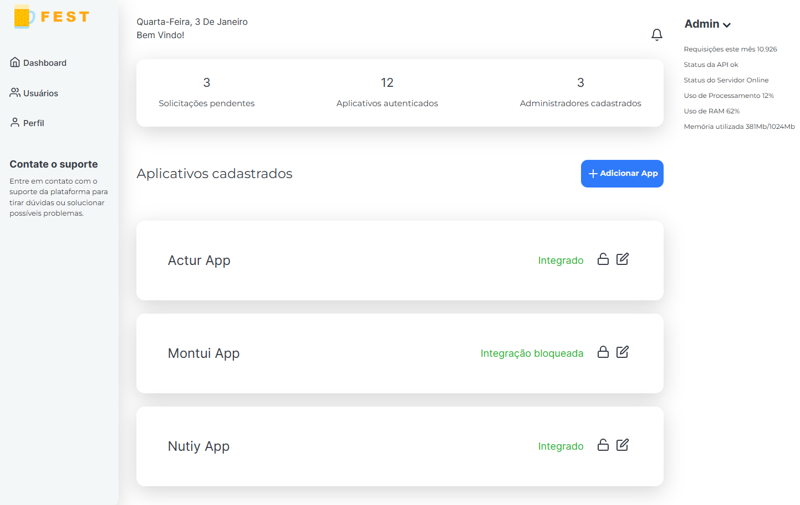

# Portifolio Admin Base

<h2  align="center">

</h2>


<p  align="center">
<a  href="#-projeto">Projeto</a>&nbsp;&nbsp;&nbsp;|&nbsp;&nbsp;&nbsp;
<a  href="#-tecnologias">Tecnologias</a>&nbsp;&nbsp;&nbsp;|&nbsp;&nbsp;&nbsp;
<a  href="#-pastas">Pastas</a>&nbsp;&nbsp;&nbsp;|&nbsp;&nbsp;&nbsp;
<a  href="#-scripts">Scripts</a>&nbsp;&nbsp;&nbsp;|&nbsp;&nbsp;&nbsp;
<a  href="#-licença">Licença</a>
</p>


## 💻 Projeto
  

Este projeto é uma aplicação ReactJS, typescript e css modules, criacao de um Admin cms, base de uma aplicação com context repositories e estruturacao, por motivos visuais, somente rota / mocada em funcionamento mas os demais arquivos e componentes constam no projeto (Mobile ainda nao feito), somente uma idealizacao.

Preview: https://hog099.github.io/portifolio-admin-front


## 🧪 Tecnologias

O projeto foi desenvolvido usando as seguintes tecnologias:


[](https://reactjs.org)
[](https://vitejs.dev)
[](https://www.typescriptlang.org)
[](https://developer.mozilla.org/pt-BR/docs/Web/CSS)
[](https://tailwindcss.com)
[](https://michalsnik.github.io/aos)


## 🗂️ Pastas

Segue abaixo padronização das pastas:

- `src`: This folder contains all the source code files for the project.
    - `components`: This folder contains reusable React components with atomic design.
    - `contexts`: This folder contains implementation context Api.
    - `guards`: This folder contains guard validation auth to provate routes.
    - `repositories`: This folder contains classes and types of backend integration.
    - `routes`: This folder contains routes logical and groups.
    - `screens`: This folder contains views navigable.
    - `services`: This folder contains libs of services like axios.
    - `styles`: This folder contains global styles and CSS modules.
    - `utils`: This folder contains utility functions and helpers.
- `public`: This folder contains static assets such as images and fonts.


## 📝 Scripts
Instale as dependências.

```bash

$ yarn

```

  
Para executar o projeto rode o comando abaixo.

```bash

$ yarn dev

```
  
Para criar o build de produção.

```bash

$ yarn build

```


## 📝 Licença 
 

This project is licensed under the MIT License. See the [LICENSE](LICENSE.md) file for details.

  ---


<p  align="center">Made with 💚 by <a  href="https://github.com/hog099"  target="_blank">Hudson Oliveira Ginelli</a></p>